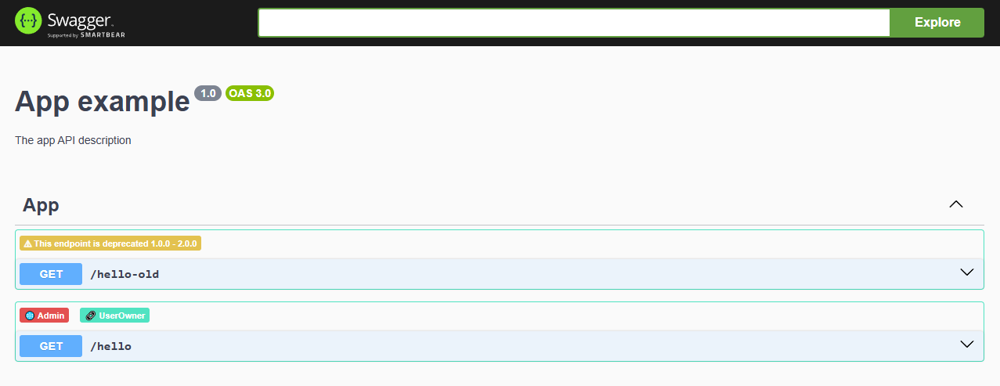

# swagger-custom-badges

[](https://www.npmjs.com/package/swagger-custom-badges)
[](LICENSE)
[](https://www.npmjs.com/package/swagger-custom-badges)

A Swagger UI plugin that displays custom badges for API operations based on OpenAPI extension fields.



## Features

- 🏷️ **Custom badges** for any OpenAPI extension field
- 🎨 **Configurable styling** with custom icons, colors, and backgrounds
- 🔧 **Flexible parsing** support for strings, arrays, and objects
- 📊 **Multiple badge types** per operation
- 🌐 **Framework agnostic** - works with any Swagger UI implementation
- ⚡ **Zero dependencies** (peer dependency on swagger-ui-dist only)

## Installation

```bash
npm install swagger-custom-badges
```

```bash
yarn add swagger-custom-badges
```

```bash
pnpm add swagger-custom-badges
```

## Quick Start

### Basic Usage

```javascript
import { CustomBadgePlugin } from 'swagger-custom-badges';

// Configure Swagger UI with the plugin
SwaggerUIBundle({
  url: './openapi.json',
  dom_id: '#swagger-ui',
  plugins: [
    CustomBadgePlugin({
      fields: [
        {
          fieldName: 'x-roles',
          badge: {
            icon: '👤',
            background: '#007bff',
            color: 'white'
          }
        }
      ]
    })
  ]
});
```

### OpenAPI Specification

Add extension fields to your OpenAPI operations:

```yaml
paths:
  /users:
    get:
      summary: Get users
      x-roles: "admin"
      responses:
        '200':
          description: Success
```

## Configuration

### Plugin Configuration

```typescript
interface PluginConfig {
  fields: FieldConfig[];           // Array of field configurations
  defaultIcon?: string;            // Default icon for all badges
  defaultColor?: string;           // Default text color
  defaultBackground?: string;      // Default background color
}
```

### Field Configuration

#### Single Badge Field

```typescript
interface SingleBadgeField {
  fieldName: string;               // OpenAPI extension field name (e.g., 'x-roles')
  badge: BadgeConfig;              // Badge styling configuration
  parser?: BadgeParser;            // Optional custom parser function
}

interface BadgeConfig {
  icon?: string;                   // Emoji or text icon
  color?: string;                  // Text color (CSS color value)
  background?: string;             // Background color (CSS color value)
}
```

#### Multi Badge Field

```typescript
interface MultiBadgeField {
  fieldName: string;               // OpenAPI extension field name
  badges: { [key: string]: BadgeConfig }; // Mapping of badge keys to configurations
  parser?: BadgeParser;            // Optional custom parser function
}
```

### Custom Parsers

Create custom parsing logic for complex field values:

```typescript
interface BadgeParser {
  (value: any): Array<{ key: string; value: any }>;
}

// Example: Custom parser for deprecated fields
const deprecatedParser = (value: { reason: string; since: string; until: string }) => [
  {
    key: 'deprecated',
    value: `${value.reason} (${value.since} - ${value.until})`
  }
];
```

## Framework Integration

### NestJS

```typescript
import { NestFactory } from '@nestjs/core';
import { SwaggerModule, DocumentBuilder } from '@nestjs/swagger';
import { CustomBadgePlugin } from 'swagger-custom-badges';
import { AppModule } from './app.module';

async function bootstrap() {
  const app = await NestFactory.create(AppModule);

  const config = new DocumentBuilder()
    .setTitle('API Documentation')
    .setDescription('API with custom badges')
    .setVersion('1.0')
    .build();

  const documentFactory = () => SwaggerModule.createDocument(app, config);
  
  SwaggerModule.setup('docs', app, documentFactory, {
    swaggerOptions: {
      plugins: [
        CustomBadgePlugin({
          fields: [
            {
              fieldName: 'x-roles',
              badges: {
                admin: { icon: '👑', background: '#dc3545' },
                user: { icon: '👤', background: '#28a745' },
                guest: { icon: '🌐', background: '#6c757d' }
              }
            },
            {
              fieldName: 'x-deprecated',
              badge: {
                icon: '⚠️',
                background: '#ffc107',
                color: '#000'
              }
            }
          ],
          defaultIcon: '🏷️',
          defaultColor: 'white',
          defaultBackground: '#6f42c1'
        })
      ]
    }
  });

  await app.listen(3000);
}
bootstrap();
```

#### Controller Example

```typescript
import { Controller, Get } from '@nestjs/common';
import { ApiExtension, ApiOperation } from '@nestjs/swagger';

@Controller('users')
export class UsersController {
  @Get()
  @ApiOperation({ summary: 'Get all users' })
  @ApiExtension('x-roles', ['admin', 'user'])
  getUsers() {
    return [];
  }

  @Get('profile')
  @ApiOperation({ summary: 'Get user profile' })
  @ApiExtension('x-roles', { admin: true, user: true })
  getProfile() {
    return {};
  }

  @Get('legacy')
  @ApiOperation({ summary: 'Legacy endpoint' })
  @ApiExtension('x-deprecated', {
    reason: 'Use /users instead',
    since: '1.0.0',
    until: '2.0.0'
  })
  getLegacy() {
    return {};
  }
}
```

### Express + swagger-ui-express

```javascript
const express = require('express');
const swaggerUi = require('swagger-ui-express');
const { CustomBadgePlugin } = require('swagger-custom-badges');
const swaggerDocument = require('./openapi.json');

const app = express();

app.use('/docs', swaggerUi.serve, swaggerUi.setup(swaggerDocument, {
  swaggerOptions: {
    plugins: [
      CustomBadgePlugin({
        fields: [
          {
            fieldName: 'x-security-level',
            badges: {
              high: { icon: '🔒', background: '#dc3545' },
              medium: { icon: '🟡', background: '#ffc107' },
              low: { icon: '🟢', background: '#28a745' }
            }
          }
        ]
      })
    ]
  }
}));
```

### Standalone Swagger UI

```html
<!DOCTYPE html>
<html>
<head>
  <title>API Documentation</title>
  <link rel="stylesheet" type="text/css" href="./swagger-ui-bundle.css" />
</head>
<body>
  <div id="swagger-ui"></div>
  <script src="./swagger-ui-bundle.js"></script>
  <script src="./swagger-custom-badges.js"></script>
  <script>
    SwaggerUIBundle({
      url: './openapi.json',
      dom_id: '#swagger-ui',
      plugins: [
        SwaggerUIBundle.plugins.DownloadUrl,
        CustomBadgePlugin({
          fields: [
            {
              fieldName: 'x-team',
              badge: {
                icon: '👥',
                background: '#17a2b8'
              }
            }
          ]
        })
      ]
    });
  </script>
</body>
</html>
```

## Examples

### Role-based Badges

```typescript
CustomBadgePlugin({
  fields: [
    {
      fieldName: 'x-auth',
      badges: {
        admin: { icon: '👑', background: '#dc3545' },
        moderator: { icon: '🛡️', background: '#fd7e14' },
        user: { icon: '👤', background: '#28a745' },
        guest: { icon: '🌐', background: '#6c757d' }
      }
    }
  ]
})
```

OpenAPI specification:
```yaml
paths:
  /admin/users:
    get:
      x-auth: ["admin"]
  /posts:
    get:
      x-auth: ["admin", "moderator", "user"]
    post:
      x-auth: { admin: true, user: true }
```

### Deprecation Badges

```typescript
CustomBadgePlugin({
  fields: [
    {
      fieldName: 'x-deprecated',
      badge: {
        icon: '⚠️',
        background: '#ffc107',
        color: '#000'
      },
      parser: (value) => [
        {
          key: 'deprecated',
          value: `Deprecated since ${value.since}`
        }
      ]
    }
  ]
})
```

### Environment Badges

```typescript
CustomBadgePlugin({
  fields: [
    {
      fieldName: 'x-environment',
      badges: {
        production: { icon: '🚀', background: '#dc3545' },
        staging: { icon: '🧪', background: '#ffc107' },
        development: { icon: '🔧', background: '#28a745' }
      }
    }
  ]
})
```

### Custom Parser Example

```typescript
CustomBadgePlugin({
  fields: [
    {
      fieldName: 'x-rate-limit',
      badge: {
        icon: '⏱️',
        background: '#6f42c1'
      },
      parser: (value) => [
        {
          key: 'rate-limit',
          value: `${value.requests}/${value.window}`
        }
      ]
    }
  ]
})
```

## Data Format Support

The plugin automatically parses different data formats:

### String Values
```yaml
x-roles: "admin,user,guest"  # Comma-separated values
```

### Array Values
```yaml
x-roles: ["admin", "user", "guest"]
```

### Object Values
```yaml
x-roles:
  admin: true
  user: false
  guest: true
```

### Complex Objects
```yaml
x-metadata:
  team: "backend"
  priority: "high"
  version: "v2"
```

## Styling

The plugin automatically injects CSS styles, but you can override them:

```css
.operation-with-badges {
  /* Container for operations with badges */
}

.badges {
  /* Container for badge row */
}

.swagger-custom-badge {
  /* Individual badge styling */
  display: inline-block;
  padding: 2px 6px;
  margin: 2px 4px 2px 0;
  font-size: 11px;
  font-weight: bold;
  border-radius: 3px;
  color: white;
}
```

## API Reference

### CustomBadgePlugin(config: PluginConfig)

Creates a new instance of the custom badge plugin.

**Parameters:**
- `config` - Plugin configuration object

**Returns:** Swagger UI plugin object

### Default Configuration

```typescript
const defaultConfig = {
  fields: [],
  defaultIcon: '🏷️',
  defaultColor: 'white',
  defaultBackground: '#50e3c2'
};
```

## Compatibility

- **Swagger UI**: 5.21.0+ (peer dependency)
- **Node.js**: 16+
- **TypeScript**: 5.0+ (optional)

## Contributing

1. Fork the repository
2. Create your feature branch (`git checkout -b feature/amazing-feature`)
3. Commit your changes (`git commit -m 'Add some amazing feature'`)
4. Push to the branch (`git push origin feature/amazing-feature`)
5. Open a Pull Request

### Development Setup

```bash
# Clone the repository
git clone https://github.com/Dexsper/swagger-custom-badges.git
cd swagger-custom-badges

# Install dependencies
npm install

# Build the project
npm run build

# Run the example
cd examples/nestjs
npm install
npm run start:dev
```

## License

This project is licensed under the MIT License - see the [LICENSE](LICENSE) file for details.

## Support

- 📝 [Issues](https://github.com/Dexsper/swagger-custom-badges/issues)
- 💬 [Discussions](https://github.com/Dexsper/swagger-custom-badges/discussions)

## Changelog

### 1.0.0
- Initial release
- Support for custom badges on Swagger UI operations
- Configurable styling options
- Multiple data format support
- NestJS example

---

Made with ❤️ by [Dexsper](https://github.com/Dexsper)
